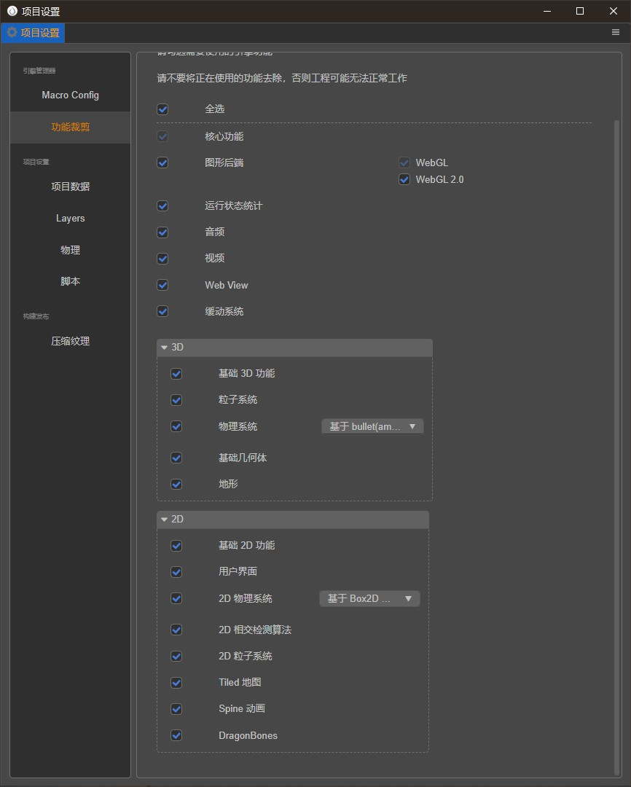

## CocosCreator3D(v3.2.0) 试玩广告制作流程

### 模块裁剪

默认勾选所有的选项,3D物理系统勾选bullet物理,2d勾选Box2D(去除其他则需要修改部分代码)


### 使用方法

#### 1.直接运行项目(main.go文件)

```go
var (
mobileDir = "E:\\Projects\\CocosProjects\\WebGameDemo"
outDir = ""
htmlFile = ""
tmpOutFile = ""
)
```

修改路径为当前需要导出试玩广告的项目路径(前提是需要在Cocos导出web-mobile项目)

#### 2.直接编译项目

编译项目为可执行文件(当前命令仅限Windows)

```shell
make build
```

导出为可执行文件,然后命令行执行对应命令(前提是需要在Cocos导出web-mobile项目)

```shell
.\Cocos3DPlayableAdPlugin.exe -path "Cocos项目对应路径"
```

### 导出的文件路径

"Cocos项目对应路径"/build/PS/index.html

### 试玩

查看(当前导出的项目为Cocos官方的示例项目)

```shell
tmpHtml/index.html
```

## 兼容CocosCreator版本升级需要调整的步骤

### 1.引擎文件的升级

查看
```shell
mix/engine/engine.go
```
(如果引擎文件的目录结构发生变化,需要修改该文件)

### 2.资源文件的升级

查看
```shell
mix/res/resource.go
```


#### 1.文本处理(添加额外的文本后缀名处理,比如自定义的json格式)

```go
text := []string{
".json", 
".txt",
}
```

#### 2.二进制文件处理(添加额外的二进制后缀名处理,比如自定义的二进制格式)
```go
bin := []string{
		".bin",
		".png",
		".jpg",
		".mp3",
		".wasm",
		".ttf",
		".cconb",(3.3.1新添加的资源后缀)
	}
```

### 3.JS加载资源
该步骤是替换原始CocosCreator引擎加载资源的逻辑转换成自己的逻辑(大部分资源已经做对应处理,如果引擎升级添加了新的资源后缀,需要在该地方添加,只需要判断它是文件资源还是二进制资源)
```js
let downloaders = {
                // Images
                '.png': downloadImage,
                '.jpg': downloadImage,
                '.bmp': downloadImage,
                '.jpeg': downloadImage,
                '.gif': downloadImage,
                '.ico': downloadImage,
                '.tiff': downloadImage,
                '.webp': downloadImage,
                '.image': downloadImage,
                '.pvr': downloadArrayBuffer,
                '.pkm': downloadArrayBuffer,
                '.astc': downloadArrayBuffer,

                // Txt
                '.txt': downloadText,
                '.xml': downloadText,
                '.vsh': downloadText,
                '.fsh': downloadText,
                '.atlas': downloadText,
                '.tmx': downloadText,
                '.tsx': downloadText,
                '.json': downloadJson,
                '.ExportJson': downloadJson,
                '.plist': downloadText,
                '.fnt': downloadText,
                '.zip': downloadText,// 按需添加

                // Font
                '.ttf': downloadFont,
                // MP3
                '.mp3': downloadAudio,
                '.ogg': downloadAudio,
                '.wav': downloadAudio,
                '.m4a': downloadAudio,

                // Binary
                '.binary': downloadArrayBuffer,
                '.bin': downloadArrayBuffer,
                '.dbbin': downloadArrayBuffer,
                '.skel': downloadArrayBuffer,

                '.js': downloadScript,

                bundle: downloadBundle,

                default: downloadText,
            };
```